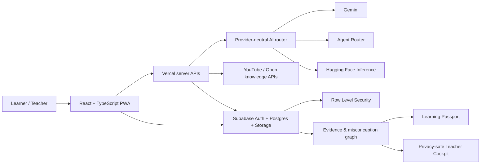

<div align="center">
  
  <h1>Fahim · فَهيم</h1>
  <p><strong>Arabic-first Verified Learning OS</strong></p>
  <p>تعلّم. حاول. افهم خطأك. وأثبت تقدّمك.</p>
  <p>
    <a href="https://fahim-ai-egypt.vercel.app">Live product</a> ·
    <a href="https://fahim-ai-egypt.vercel.app/showcase">90-second judge path</a> ·
    <a href="https://fahim-ai-egypt.vercel.app/evidence">Evidence room</a> ·
    <a href="docs/HACKATHON_READINESS_REPORT_2026.md">Hackathon readiness</a> ·
    <a href="docs/VNEXT_IMPLEMENTATION_AUDIT_2026-09-16.md">vNext audit</a> ·
    <a href="docs/ARCHITECTURE.md">Architecture</a>
  </p>
</div>


Fahim turns a learning interaction into an inspectable chain of evidence:

```text
Source → First attempt → Misconception → Intervention → Retry → Evidence → Memory
```

It is not another answer chatbot or course catalogue. Its core product unit is a measurable change in understanding: what the learner believed, why it was incomplete, which intervention helped, what evidence now supports mastery, and when the concept should be recalled again.

## Why this exists

Arabic-speaking learners can access more content than ever, yet most products still optimize for completion, watch time, or answer delivery. Those signals do not prove understanding. Fahim is designed around a harder question:

> Can the learner explain, retrieve, transfer, and defend the concept using trustworthy sources?

The product combines an Arabic-first AI tutor, adaptive assessment, misconception diagnosis, claim-level source labels, spaced review, teacher insight, and a private Learning Passport. The distinctive system is the **Learning Evidence Graph**—a traceable learning record instead of a vanity progress bar.

## Competition demo

Open [`/showcase`](https://fahim-ai-egypt.vercel.app/showcase). It is deterministic, needs no visible account flow, and is designed for a four-minute judging slot.

1. Meet one learner in one high-stakes moment.
2. Inspect the trusted source and first attempt.
3. See the misconception represented as a revisable AI hypothesis.
4. Follow the bilingual intervention and retry.
5. Inspect five evidence dimensions and the next review decision.
6. See the privacy-preserving teacher signal.

All showcase outcomes are visibly labelled **illustrative demo data** and never enter a learner account. Fahim does not claim pilot outcomes, institutional accreditation, or partnerships that do not yet exist.

Open [`/evidence`](https://fahim-ai-egypt.vercel.app/evidence) to inspect the weighted readiness estimate, the reproducible 12-control guard suite, the evidence ladder, and every boundary that still requires real learners or partners.

### Open Judge Mode

The competition build opens the complete learner product without showing sign-in or registration. On first visit, Supabase creates a unique anonymous Auth user for that browser. It is an authenticated, device-bound identity—not public database access—so the existing owner-scoped RLS policies continue to isolate paths, attempts, files, agent memory, badges, and credentials per visitor.

- `/login`, `/register`, and recovery routes remain in the codebase but redirect to the product while open mode is active.
- Learner capabilities are unlocked; teacher, staff, and admin data still require explicit roles.
- The session persists in browser storage. Clearing site data or moving to another device starts a new isolated learner record.
- Set `VITE_OPEN_JUDGE_MODE=false` to restore the account-entry UI after the competition window.

## Product capabilities

| Learning system | What is implemented |
|---|---|
| Verified Learning Loop | Source, attempt, diagnosis, intervention, retry, evidence, scheduled recall — and the return leg: a graded review emits `review_recalled` and updates measured recall |
| AI tutor | Streaming Arabic/English instruction, teach-back, retrieval mode, source-aware explanations, provider failover, per-provider deadline budget |
| Assessment | Generated quizzes with server-sealed answers and server-side grading; one course is graded and recorded in the database end to end. Difficulty is chosen by the learner, not yet adapted from history |
| Misconception Atlas | Normalized misconception events, learner patterns, teacher aggregates with privacy suppression. The category is a model label — an unvalidated hypothesis, so no numeric confidence is reported |
| Knowledge Vault | Private uploads, local extraction/chunking and lexical retrieval (BM25 + Arabic/English bridge); the protected gateway now provides 1024-dimensional multilingual embeddings and cosine reranking, while vector persistence and OCR ingestion remain pending |
| Learning Passport | Evidence sessions, mistake portfolio, badges, HMAC-SHA256 signed completion credentials with recomputed verification and admin revocation |
| Teacher Cockpit | Organizations, classes, join codes, assignments, pilot measurements, cohort signals |
| Discovery | Verified Egypt source registry, Wikimedia, OpenAlex, Crossref, YouTube Data API and embedded learning player |
| Retention | Adaptive spaced repetition inspired by SM-2 (not SM-2 itself), memory queue, and due reviews saved automatically to the visitor's private browser session; permanent-account mode can restore cross-device sync when re-enabled |
| Trust | Supabase RLS, server authorization, CSP, rate controls, audit trail, claim labels and honest fallback states |
| Access | Arabic/English, RTL/LTR, light/dark/system, reduced motion, low-bandwidth mode, responsive PWA |
| Credential path | Exactly one catalog course (`physics-force-motion`) is server-backed, so it is the only one that can currently produce a credential. The other nine paths are device-local |

## The Fahim Tutor Agent

Fahim ships a production-oriented **tutoring agent** (`/agent`, server route `/api/agent`), not a single-shot chatbot. Given one learner goal, it runs a bounded **plan → act → observe** loop under a deterministic pedagogical policy; GenAI is used only where semantic generation adds value (diagnosis, reasoning assessment, and targeted teaching). This keeps state transitions, budgets, mastery updates, and completion criteria auditable instead of delegating control to an unconstrained model planner.

- **Real tools:** `get_learner_state`, `search_verified_sources`, `generate_diagnostic`, `assess_answer`, `diagnose_misconception`, `select_next_item`, `explain_concept`, `schedule_review`, and `record_evidence`, plus human-in-the-loop prompts.
- **Proof before mastery:** a correct choice alone cannot complete a concept. The policy requires explanation or transfer evidence, preventing lucky-click mastery.
- **Server-authoritative checkpoints:** pending answers, mastery state, attempts, and review decisions live in `agent_sessions`; the browser resumes by opaque session ID and never receives the answer key.
- **Durable memory:** per-concept BKT mastery and IRT ability persist in `concept_mastery`; review scheduling persists as an FSRS card on `review_items`.
- **Grounded and bounded:** citations come from an allowlisted source registry, model calls have deadlines and failover, and each turn has a seven-step ceiling with safe retry/resume/cancel behavior.
- **Transparent by design:** Agent Studio streams reason codes, tool actions, and sanitized observations over NDJSON—never hidden chain-of-thought—while mastery and evidence update live.
- Zero new serverless functions: the agent is a sub-route of `/api/ai` to stay within the Vercel function ceiling.

### Business impact for an educational SME (Agents at Work)

Framed as an **AI teaching assistant** for a tutoring centre, the Teacher Cockpit's **Business Impact** tab turns real agent activity (sessions, assessments graded, reviews scheduled) into a transparent projection of **hours saved, cost saved, extra student capacity, and revenue enabled** via `sme_impact_summary_v1`. Every figure equals *real activity × editable centre assumptions* and is labelled a projection, never a measured financial outcome.

## Architecture



See [Architecture](docs/ARCHITECTURE.md) for trust boundaries, data ownership, AI routing, and runtime topology.

## Technology

- React 18, TypeScript, Vite, React Router, Framer Motion and Tailwind CSS.
- Supabase Auth, PostgreSQL, Storage, Realtime, SQL RPCs and Row Level Security.
- Vercel serverless APIs with streaming, health checks, security headers and production smoke tests.
- Provider-neutral AI routing with failover and no model/vendor disclosure in learner-facing copy.
- Vitest, ESLint, TypeScript checks, contract tests, security scanning and deterministic builds.

## Local development

Prerequisites: Node.js 20+ and a Supabase project.

```bash
npm install
cp .env.example .env.local
npm run dev
```

Never put server secrets behind a `VITE_` prefix. The browser receives only the Supabase URL and anonymous key. Configure production values in Vercel and Supabase—not in Git.

### Environment variable groups

| Group | Names |
|---|---|
| Browser-safe | `VITE_SUPABASE_URL`, `VITE_SUPABASE_ANON_KEY` |
| Server data | `SUPABASE_URL`, `SUPABASE_ANON_KEY`, `SUPABASE_SERVICE_ROLE_KEY` |
| AI routing | `AI_PROVIDER_ORDER`, `AGENT_ROUTER_*`, `GEMINI_*`, `HF_TOKEN`, `HF_FREE_FIRST`, `HF_EMBEDDING_MODEL` |
| External search | `YOUTUBE_API_KEY` |
| Integrity | `QUIZ_TOKEN_SECRET`, `FAHIM_ALLOWED_ORIGINS`, `PUBLIC_SITE_URL` |

The complete names-only template is [.env.example](.env.example).

## Quality gates

```bash
npm run check              # brand render + types + lint + tests + build + secret scan
npm run evaluation:check   # regenerate and verify deterministic learning guards
npm run audit:production   # production dependency audit
npm run smoke:production   # public route/API smoke test
npm run load:test          # controlled API load probe
```

The repository currently contains 206 automated tests across 40 files, 33 Supabase migrations, 39 page components, and 12 top-level server API modules. Counts are implementation inventory—not claims of user impact.

The suite mixes runtime behavior tests (routing, deadline budgets, session integrity, server grading, rate limits, spaced repetition, credentials, and agent policy) with source-contract checks. **There is no committed component or browser E2E suite**—manual browser verification complements, but does not replace, this automated gap. The `evaluation:check` controls are deterministic engineering guards, not evidence of learner impact.

## Repository map

```text
api/                     Vercel serverless routes and server-only integrations
api/_lib/                AI routing, security, auth, billing and ranking helpers
public/brand/            Source SVG identity and reproducible PNG exports
scripts/                 Quality, security, load and production smoke tooling
src/components/          Shared product, learning and evidence UI
src/pages/               Public, learner, teacher, admin and trust journeys
src/lib/                 Domain logic plus Supabase clients and sync layers
src/lib/supabase/        Auth client, cloud sync and migration audit
supabase/migrations/     Canonical relational schema, RPCs and RLS
supabase/templates/      Branded auth email templates
supabase/legacy_migrations/  Quarantined migration, kept for audit only
docs/                    Architecture, pilot, demo and hackathon evidence
```

## Hackathon positioning

Fahim targets two events with one integrated product:

**GenAI for Education 2026 — primary theme:** Assessment Revolution; secondary: Best Arabic-Language Solution.

> Fahim is the Arabic-first operating system that converts learning into evidence a learner, teacher, and parent can inspect—without exposing private conversations or pretending that completion equals mastery.

**Agents at Work (Egyptian SMEs) — track:** an autonomous agent that does a real job for a business.

> The Fahim Tutor Agent is an AI teaching assistant for an educational SME (a tutoring centre): it diagnoses each learner, grades and updates mastery, teaches from verified sources, and schedules review autonomously — saving staff hours and expanding how many students one teacher can serve. Impact is quantified in the Teacher Cockpit's Business Impact tab as *real activity × editable assumptions*, never as a fabricated result.

The previously published internal readiness figure of **85/100** predates the 2026-09-15 hardening pass and must be treated as stale. Several gaps it was scored against have since closed (signed and verified credentials, admin revocation, a closed learning loop, a server-graded course assessment, metered quiz spend, a single migration tree, security headers on the only deploy config), while others remain open and must still be scored honestly: there is no component or E2E test layer, one course is server-backed rather than the whole catalogue, manual payment methods must be configured with real account details before the paid flow can run, and no pilot or learning-gain measurement exists. **Re-derive the score from the current repository before citing any number.** See the [Hackathon Readiness Report](docs/HACKATHON_READINESS_REPORT_2026.md).

## Evidence policy

- AI confidence is a revisable hypothesis, never a diagnosis presented as fact.
- Every answer is classified as verified source, reasoned inference, educational explanation, or needs review.
- Demo data is visually labelled and isolated from production learner records.
- Completion credentials are verifiable product records, not claims of external accreditation.
- Parent and teacher views expose progress signals—not private learner chat by default.
- No traction, learning gain, accuracy, partnership, or accreditation metric is published without a reproducible source.

## Documentation

- [Hackathon Readiness Report](docs/HACKATHON_READINESS_REPORT_2026.md)
- [vNext implementation audit — 16 September 2026](docs/VNEXT_IMPLEMENTATION_AUDIT_2026-09-16.md)
- [AI evaluation protocol](docs/AI_EVALUATION_PROTOCOL.md)
- [Judge evidence index](docs/JUDGE_EVIDENCE_INDEX.md)
- [Architecture and trust boundaries](docs/ARCHITECTURE.md)
- [Four-minute demo runbook](docs/DEMO_RUNBOOK.md)
- [Pilot and measurement protocol](docs/PILOT_PROTOCOL.md)
- [Competition implementation map](FAHIM_HACKATHON_2026.md)
- [Product and business master plan](FAHIM_MASTER_PLAN_2026.md)
- [Canonical implementation specification](NEXT_IMPLEMENTATION_SPEC.md)

## Contribution and ownership

This is a private, proprietary competition and product repository. Read [CONTRIBUTING.md](CONTRIBUTING.md) before making changes. Security issues must be reported privately and must not include learner data in tickets.

Copyright © 2026 Marwan Abdelghaffar and Fahim AI. All rights reserved.
