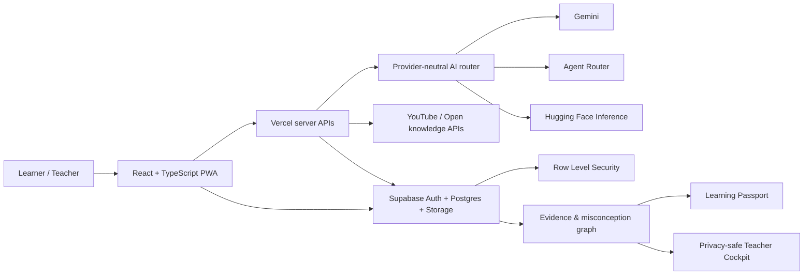

<div align="center">
  
  <h1>Fahim · فَهيم</h1>
  <p><strong>Arabic-first Verified Learning OS</strong></p>
  <p>تعلّم. حاول. افهم خطأك. وأثبت تقدّمك.</p>
  <p>
    <a href="https://fahim-ai-egypt.vercel.app">Live product</a> ·
    <a href="https://fahim-ai-egypt.vercel.app/showcase">90-second judge path</a> ·
    <a href="https://fahim-ai-egypt.vercel.app/evidence">Evidence room</a> ·
    <a href="docs/HACKATHON_READINESS_REPORT_2026.md">Hackathon readiness</a> ·
    <a href="docs/VNEXT_IMPLEMENTATION_AUDIT_2026-09-16.md">vNext audit</a> ·
    <a href="docs/ARCHITECTURE.md">Architecture</a>
  </p>
</div>


Fahim turns a learning interaction into an inspectable chain of evidence:

```text
Source → First attempt → Misconception → Intervention → Retry → Evidence → Memory
```

It is not another answer chatbot or course catalogue. Its core product unit is a measurable change in understanding: what the learner believed, why it was incomplete, which intervention helped, what evidence now supports mastery, and when the concept should be recalled again.

## Why this exists

Arabic-speaking learners can access more content than ever, yet most products still optimize for completion, watch time, or answer delivery. Those signals do not prove understanding. Fahim is designed around a harder question:

> Can the learner explain, retrieve, transfer, and defend the concept using trustworthy sources?

The product combines an Arabic-first AI tutor, adaptive assessment, misconception diagnosis, claim-level source labels, spaced review, teacher insight, and a private Learning Passport. The distinctive system is the **Learning Evidence Graph**—a traceable learning record instead of a vanity progress bar.

## Competition demo

Open [`/showcase`](https://fahim-ai-egypt.vercel.app/showcase). It is deterministic, needs no account, and is designed for a four-minute judging slot.

1. Meet one learner in one high-stakes moment.
2. Inspect the trusted source and first attempt.
3. See the misconception represented as a revisable AI hypothesis.
4. Follow the bilingual intervention and retry.
5. Inspect five evidence dimensions and the next review decision.
6. See the privacy-preserving teacher signal.

All showcase outcomes are visibly labelled **illustrative demo data** and never enter a learner account. Fahim does not claim pilot outcomes, institutional accreditation, or partnerships that do not yet exist.

Open [`/evidence`](https://fahim-ai-egypt.vercel.app/evidence) to inspect the weighted readiness estimate, the reproducible 12-control guard suite, the evidence ladder, and every boundary that still requires real learners or partners.

## Product capabilities

| Learning system | What is implemented |
|---|---|
| Verified Learning Loop | Source, attempt, diagnosis, intervention, retry, evidence, scheduled recall — and the return leg: a graded review emits `review_recalled` and updates measured recall |
| AI tutor | Streaming Arabic/English instruction, teach-back, retrieval mode, source-aware explanations, provider failover, per-provider deadline budget |
| Assessment | Generated quizzes with server-sealed answers and server-side grading; one course is graded and recorded in the database end to end. Difficulty is chosen by the learner, not yet adapted from history |
| Misconception Atlas | Normalized misconception events, learner patterns, teacher aggregates with privacy suppression. The category is a model label — an unvalidated hypothesis, so no numeric confidence is reported |
| Knowledge Vault | Private uploads, local extraction/chunking and lexical retrieval (BM25 + Arabic/English bridge); the protected gateway now provides 1024-dimensional multilingual embeddings and cosine reranking, while vector persistence and OCR ingestion remain pending |
| Learning Passport | Evidence sessions, mistake portfolio, badges, HMAC-SHA256 signed completion credentials with recomputed verification and admin revocation |
| Teacher Cockpit | Organizations, classes, join codes, assignments, pilot measurements, cohort signals |
| Discovery | Verified Egypt source registry, Wikimedia, OpenAlex, Crossref, YouTube Data API and embedded learning player |
| Retention | Adaptive spaced repetition inspired by SM-2 (not SM-2 itself), memory queue, due reviews, synced to Supabase so the schedule survives a device change |
| Trust | Supabase RLS, server authorization, CSP, rate controls, audit trail, claim labels and honest fallback states |
| Access | Arabic/English, RTL/LTR, light/dark/system, reduced motion, low-bandwidth mode, responsive PWA |
| Credential path | Exactly one catalog course (`physics-force-motion`) is server-backed, so it is the only one that can currently produce a credential. The other nine paths are device-local |

## Architecture



See [Architecture](docs/ARCHITECTURE.md) for trust boundaries, data ownership, AI routing, and runtime topology.

## Technology

- React 18, TypeScript, Vite, React Router, Framer Motion and Tailwind CSS.
- Supabase Auth, PostgreSQL, Storage, Realtime, SQL RPCs and Row Level Security.
- Vercel serverless APIs with streaming, health checks, security headers and production smoke tests.
- Provider-neutral AI routing with failover and no model/vendor disclosure in learner-facing copy.
- Vitest, ESLint, TypeScript checks, contract tests, security scanning and deterministic builds.

## Local development

Prerequisites: Node.js 20+ and a Supabase project.

```bash
npm install
cp .env.example .env.local
npm run dev
```

Never put server secrets behind a `VITE_` prefix. The browser receives only the Supabase URL and anonymous key. Configure production values in Vercel and Supabase—not in Git.

### Environment variable groups

| Group | Names |
|---|---|
| Browser-safe | `VITE_SUPABASE_URL`, `VITE_SUPABASE_ANON_KEY` |
| Server data | `SUPABASE_URL`, `SUPABASE_ANON_KEY`, `SUPABASE_SERVICE_ROLE_KEY` |
| AI routing | `AI_PROVIDER_ORDER`, `AGENT_ROUTER_*`, `GEMINI_*`, `HF_TOKEN`, `HF_FREE_FIRST`, `HF_EMBEDDING_MODEL` |
| External search | `YOUTUBE_API_KEY` |
| Integrity | `QUIZ_TOKEN_SECRET`, `FAHIM_ALLOWED_ORIGINS`, `PUBLIC_SITE_URL` |

The complete names-only template is [.env.example](.env.example).

## Quality gates

```bash
npm run check              # brand render + types + lint + tests + build + secret scan
npm run evaluation:check   # regenerate and verify deterministic learning guards
npm run audit:production   # production dependency audit
npm run smoke:production   # public route/API smoke test
npm run load:test          # controlled API load probe
```

The repository currently contains 150 automated tests across 32 files, 25 Supabase migrations, 36 page components, and 14 top-level server API modules. Counts are implementation inventory—not claims of user impact.

Of those tests, 19 files assert runtime behaviour (routing, deadline budgets, sealed-token grading, rate-limit buckets, spaced repetition, credential levels, master classes) and 13 assert source contracts by reading files. **There is no component or end-to-end test layer** — no `@testing-library/react`, no browser driver — so no test currently renders a React component or exercises a full user journey. The `evaluation:check` "12 controls" are source-contract substring checks, not behavioural verification.

## Repository map

```text
api/                     Vercel serverless routes and server-only integrations
api/_lib/                AI routing, security, auth, billing and ranking helpers
public/brand/            Source SVG identity and reproducible PNG exports
scripts/                 Quality, security, load and production smoke tooling
src/components/          Shared product, learning and evidence UI
src/pages/               Public, learner, teacher, admin and trust journeys
src/lib/                 Domain logic plus Supabase clients and sync layers
src/lib/supabase/        Auth client, cloud sync and migration audit
supabase/migrations/     Canonical relational schema, RPCs and RLS
supabase/templates/      Branded auth email templates
supabase/legacy_migrations/  Quarantined migration, kept for audit only
docs/                    Architecture, pilot, demo and hackathon evidence
```

## Hackathon positioning

**Primary theme:** Assessment Revolution.  
**Secondary strength:** Best Arabic-Language Solution.

The recommended narrative is not “chat + videos + quizzes.” It is:

> Fahim is the Arabic-first operating system that converts learning into evidence a learner, teacher, and parent can inspect—without exposing private conversations or pretending that completion equals mastery.

The previously published internal readiness figure of **85/100** predates the 2026-09-15 hardening pass and must be treated as stale. Several gaps it was scored against have since closed (signed and verified credentials, admin revocation, a closed learning loop, a server-graded course assessment, metered quiz spend, a single migration tree, security headers on the only deploy config), while others remain open and must still be scored honestly: there is no component or E2E test layer, one course is server-backed rather than the whole catalogue, manual payment methods must be configured with real account details before the paid flow can run, and no pilot or learning-gain measurement exists. **Re-derive the score from the current repository before citing any number.** See the [Hackathon Readiness Report](docs/HACKATHON_READINESS_REPORT_2026.md).

## Evidence policy

- AI confidence is a revisable hypothesis, never a diagnosis presented as fact.
- Every answer is classified as verified source, reasoned inference, educational explanation, or needs review.
- Demo data is visually labelled and isolated from production learner records.
- Completion credentials are verifiable product records, not claims of external accreditation.
- Parent and teacher views expose progress signals—not private learner chat by default.
- No traction, learning gain, accuracy, partnership, or accreditation metric is published without a reproducible source.

## Documentation

- [Hackathon Readiness Report](docs/HACKATHON_READINESS_REPORT_2026.md)
- [vNext implementation audit — 16 September 2026](docs/VNEXT_IMPLEMENTATION_AUDIT_2026-09-16.md)
- [AI evaluation protocol](docs/AI_EVALUATION_PROTOCOL.md)
- [Judge evidence index](docs/JUDGE_EVIDENCE_INDEX.md)
- [Architecture and trust boundaries](docs/ARCHITECTURE.md)
- [Four-minute demo runbook](docs/DEMO_RUNBOOK.md)
- [Pilot and measurement protocol](docs/PILOT_PROTOCOL.md)
- [Competition implementation map](FAHIM_HACKATHON_2026.md)
- [Product and business master plan](FAHIM_MASTER_PLAN_2026.md)
- [Canonical implementation specification](NEXT_IMPLEMENTATION_SPEC.md)

## Contribution and ownership

This is a private, proprietary competition and product repository. Read [CONTRIBUTING.md](CONTRIBUTING.md) before making changes. Security issues must be reported privately and must not include learner data in tickets.

Copyright © 2026 Marwan Abdelghaffar and Fahim AI. All rights reserved.
