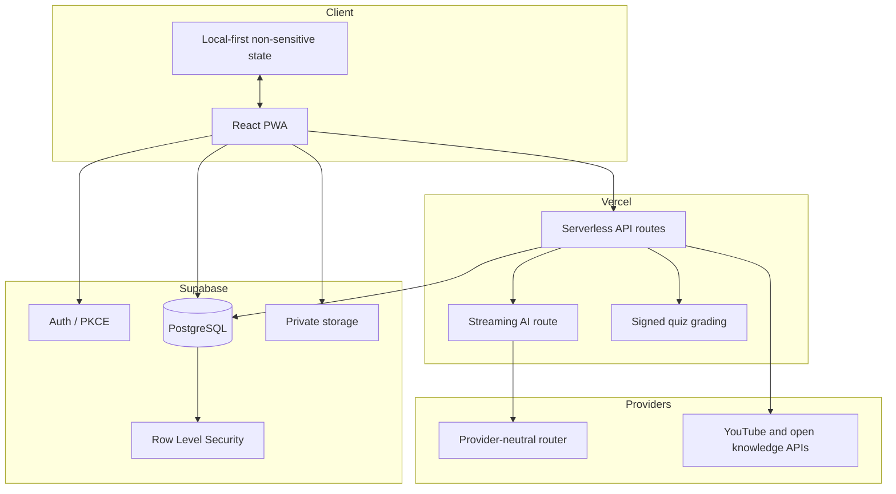

# Fahim Architecture and Trust Boundaries

## System shape

Fahim is a React/TypeScript progressive web application deployed on Vercel. Server APIs own secret integrations and integrity-sensitive operations. Supabase owns authentication, PostgreSQL data, storage, realtime behavior and Row Level Security.

## Domain ownership

- `learning_sessions` is the aggregate root for a concept attempt.
- `learning_events` preserves the ordered source-to-memory trail.
- Evidence claims, misconception events, review items and mistake portfolio records are specialized artifacts.
- Organizations, classes, assignments and submissions model the teacher workflow.
- Impact pilots and measurements store real pre/post/delayed/transfer evidence; no success values are seeded.
- Credentials are product completion records with verification and revocation state.

## Trust boundaries

- Browser code never receives service-role, AI-provider, quiz-signing or database passwords.
- A learner can access only owned learning records.
- A teacher can access only authorized classes and privacy-safe aggregates.
- Small cohort misconception counts are suppressed to reduce re-identification risk.
- Correct quiz answers remain server-side until grading.
- AI/provider/model identities remain implementation details; educational evidence and source quality are user-facing.
- The deterministic showcase is isolated from production learner state.

## Reliability model

- AI requests use provider-neutral routing and failover.
- Public judging does not depend on authentication or an AI provider.
- Health, security, load and production smoke scripts are part of the repository.
- Local-first interaction prevents avoidable UI blocking; authoritative private records sync through Supabase.
- Rate controls, CSP and server-side validation protect public and privileged routes.

## Known operational gaps

- Formal AI golden-set evaluation and regression dashboard.
- Sustained multi-region load/soak evidence and measured SLO history.
- Full scanned-document OCR evaluation.
- Independent security assessment and documented incident exercises.
- Institution-backed credential issuer operations.
