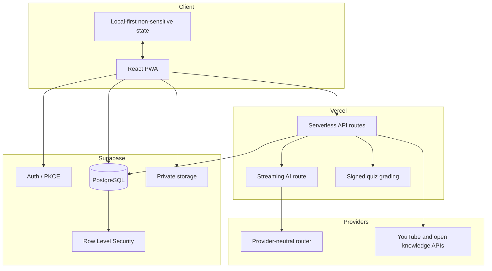

# Fahim Architecture and Trust Boundaries

## System shape

Fahim is a React/TypeScript progressive web application deployed on Vercel. Server APIs own secret integrations and integrity-sensitive operations. Supabase owns authentication, PostgreSQL data, storage, realtime behavior and Row Level Security.

## Domain ownership

- `learning_sessions` is the aggregate root for a concept attempt.
- `learning_events` preserves the ordered source-to-memory trail. The trail is now closed in both directions: grading a spaced-review card writes a `review_recalled` event back onto the session and updates the measured `recall` dimension, and completing a teach-back writes `transfer_applied`.
- Evidence claims, misconception events and review items are specialized artifacts. Review items live in `public.review_items` and are synced from the browser, so a learner's schedule survives a device change. The misconception category is a normalized model label with no calibrated confidence attached.
- Organizations, classes, assignments and submissions model the teacher workflow.
- Impact pilots and measurements store real pre/post/delayed/transfer evidence; no success values are seeded.
- Credentials are product completion records signed with **HMAC-SHA256** over a canonical payload (certificate number, user, course, credential type, final score, achievement tier) using a key generated inside the database and stored in `credential_signing_keys` (RLS enabled, no policies, grants revoked from `anon` and `authenticated`). A `BEFORE INSERT OR UPDATE` trigger signs every issuance path, including the admin API, so no unsigned record can be produced. `verify_certificate_v3` **recomputes** the signature and returns `signature_valid`, instead of echoing the stored value, and returns an allowlisted evidence projection rather than the raw snapshot — the raw snapshot carries internal reviewer notes. Revocation is implemented by the admin-only `revoke_certificate_v1`, which sets `status`, `revoked_at`, the reason in `metadata`, and an `audit_logs` row.
- Course completion: `public.progress` is written by the browser on lesson completion for server-backed courses, and a course assessment is graded and recorded entirely inside the database (`course_assessment_v1` projects questions without their answer keys; `submit_course_assessment_v1` grades a submission, computes the attempt number, and inserts into `quiz_results`). Those two tables are what `my_certificate_eligibility_v2` and the `path_finisher` badge read, which is why they previously could never return anything.

## Trust boundaries

- Browser code never receives service-role, AI-provider, quiz-signing or database passwords.
- A learner can access only owned learning records.
- A teacher can access only authorized classes and privacy-safe aggregates.
- Small cohort misconception counts are suppressed to reduce re-identification risk.
- Correct quiz answers remain server-side until grading.
- AI/provider/model identities remain implementation details; educational evidence and source quality are user-facing.
- The deterministic showcase is isolated from production learner state.

## Reliability model

- AI requests use provider-neutral routing and failover, bounded by a per-request deadline budget that stays inside the platform function limit. Token usage and estimated cost are recorded on every chat and quiz generation.
- Public judging does not depend on authentication or an AI provider.
- Health, security, load and production smoke scripts are part of the repository. `/api/health?mode=live` is a no-I/O liveness probe; `/api/health?mode=ready` probes PostgREST and reports `503` with `status: not_ready` when a dependency is down.
- Every API response emits one structured JSON log line carrying the request id, route, method, status and duration, so a reported failure can be correlated to an invocation. Degradation to per-instance rate-limit buckets, and AI provider exhaustion with its attempts, are logged as alertable events.
- Local-first interaction prevents avoidable UI blocking. Records that sync through Supabase: learning sessions, learning events, review items, conversations, and lesson progress for server-backed courses. Records that stay on the device: catalog course progress for the nine local-only paths, the Knowledge Vault (IndexedDB), and study-progress counters.
- Rate controls, CSP and server-side validation protect public and privileged routes.

## Known operational gaps

- Formal AI golden-set evaluation and regression dashboard.
- Sustained multi-region load/soak evidence and measured SLO history.
- Full scanned-document OCR evaluation.
- Independent security assessment and documented incident exercises.
- Institution-backed credential issuer operations.
- No component or end-to-end test layer: nothing in the suite renders a React component or drives a browser journey.
- Exactly one catalog course is server-backed and therefore credential-eligible; the other nine paths record progress only on the device.
- The manual transfer flow stays closed until an administrator publishes a verified payment destination, because the product refuses to display a placeholder account number.
- Misconception diagnosis accuracy is unmeasured; the category is an unvalidated model label and no confidence value is reported for it.
- Knowledge Vault retrieval is still lexical in the learner-facing flow (BM25 with an Arabic/English bridge). The protected AI gateway can now produce 1024-dimensional multilingual embeddings and cosine reranking, but vector persistence and hybrid retrieval over production curriculum chunks are not connected yet.
- No per-user or aggregate spend cap in currency: cost is recorded per generation but not enforced against a budget.
